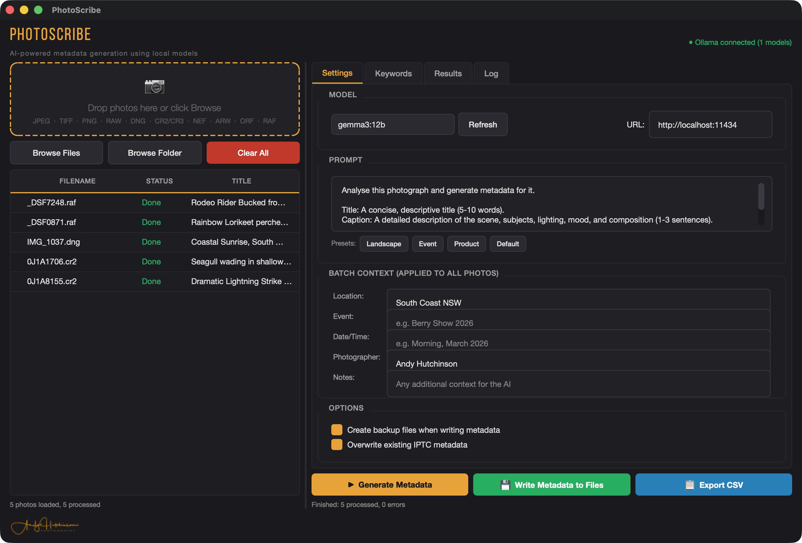

# PhotoScribe

AI-powered photo metadata generator that runs entirely on your machine. Uses local Ollama models to analyse your photographs and write title, caption, and keywords directly to IPTC/XMP metadata.

No cloud services. No subscriptions. No data leaves your computer.



## What it does

1. **Drop** photos into the app (drag and drop or browse)
2. **Set context** (location, event, photographer) to help the AI
3. **Generate** titles, captions, and keywords using a local vision model
4. **Review and edit** everything before committing
5. **Write** IPTC + XMP metadata directly to your files

Metadata is written to both IPTC and embedded XMP, so Lightroom Classic, Capture One, Photo Mechanic, Bridge, and every other cataloguing tool picks it up on import.

## Supported formats

**Standard:** JPEG, TIFF, PNG, WebP

**RAW:** CR2, CR3 (Canon), NEF (Nikon), ARW (Sony), ORF (Olympus/OM System), RAF (Fujifilm), RW2 (Panasonic), PEF (Pentax), DNG, and more

## Requirements

Before running PhotoScribe, you need three things installed on your system:

### 1. Python 3.10-3.13

> **Important:** Python 3.14 is not yet supported (PySide6 and rawpy don't have compatible releases). Use Python 3.13 for the best experience.

- **macOS:** `brew install python@3.13` or download from [python.org](https://www.python.org/downloads/)
- **Windows:** Download from [python.org](https://www.python.org/downloads/) (tick "Add Python to PATH" during install)
- **Linux:** `sudo apt install python3 python3-venv python3-pip`

The install script will automatically find the best compatible Python version on your system.

### 2. Ollama (runs the AI model locally)

Download from [ollama.com](https://ollama.com/download) and install. Then pull a vision model:

```bash
# Good quality, runs on most modern machines (~3GB)
ollama pull gemma3:4b

# Better quality, needs 8GB+ RAM (~8GB)
ollama pull gemma3:12b
```

Make sure Ollama is running before launching PhotoScribe:

```bash
ollama serve
```

### 3. ExifTool (writes metadata to files)

- **macOS:** `brew install exiftool`
- **Windows:** Download from [exiftool.org](https://exiftool.org), extract `exiftool.exe` to a folder in your PATH
- **Linux:** `sudo apt install libimage-exiftool-perl`

## Quick start

### macOS / Linux

```bash
git clone https://github.com/repomonkey/photoscribe.git
cd photoscribe
./install.sh
```

The install script checks all dependencies, sets up a Python virtual environment, installs packages, and launches the app. Run `./install.sh` again any time to launch.

### Windows

```cmd
git clone https://github.com/repomonkey/photoscribe.git
cd photoscribe
install.bat
```

### Manual setup

If you prefer to do it yourself:

```bash
git clone https://github.com/repomonkey/photoscribe.git
cd photoscribe
python3 -m venv venv
source venv/bin/activate        # macOS/Linux
# venv\Scripts\activate.bat     # Windows
pip install -r requirements.txt
python photoscribe.py
```

## Features

- **Drag and drop** photos or browse files/folders
- **RAW file support** via rawpy (CR2, CR3, NEF, ARW, ORF, RAF, RW2, PEF, DNG, and more)
- **Model selection** with any vision model available in your Ollama instance
- **Customisable prompts** with presets (Landscape, Event, Product)
- **Batch context** for location, event, photographer, date/time
- **Keyword vocabulary** for consistent tagging across your catalogue
- **Review and edit** all generated metadata before writing
- **IPTC + XMP** metadata written directly to files via ExifTool
- **Backup option** with persistent settings
- **CSV export** for spreadsheet review
- **Dark UI** because photographers have standards

## Tips

- **Model size matters.** The 12b model produces noticeably better captions than 4b, which in turn beats 1b significantly. Use the biggest model your hardware can handle.
- **Set batch context.** The model produces much better results when it knows the location and event. Don't skip this.
- **Use the keyword vocabulary** if you need consistent terms across your catalogue.
- **Review before writing.** The AI is good but not infallible. The results panel lets you edit everything before it touches your files.
- **Backups** are on by default. Once you trust the workflow, you can disable them in Options.

## How it works

PhotoScribe sends a resized JPEG version of your photo (max 1024px) to your local Ollama instance along with your prompt and context. The model analyses the image and returns structured JSON with title, caption, and keywords. Nothing is uploaded anywhere: the model runs on your CPU/GPU.

When you write metadata, PhotoScribe uses ExifTool to embed IPTC and XMP data directly into your files. This is the same approach used by professional DAM tools and ensures compatibility with every major photo cataloguing application.

## Troubleshooting

**"Cannot connect to Ollama"**
Run `ollama serve` in a terminal. On macOS, Ollama may already be running as a menu bar app.

**"exiftool not found"**
Install ExifTool using the instructions above. On macOS, `brew install exiftool` is the easiest path.

**RAW files not loading**
Make sure `rawpy` is installed: `pip install rawpy`. The install script handles this automatically.

**App won't launch on macOS**
If you get a security warning, go to System Settings > Privacy & Security and allow the app to run.

**Slow generation**
Larger models take longer. On a Mac with Apple Silicon, the 12b model typically processes a photo in 5-15 seconds. If it's very slow, try the 4b model.

**"No matching distribution found" or PySide6 errors during install**
You're likely running Python 3.14, which isn't supported yet. Install Python 3.13: `brew install python@3.13` (macOS) and run the install script again. It will automatically pick the right version.

## Licence

MIT

## Credits

Built by [Andy Hutchinson](https://andyhutchinson.com.au) | [YouTube](https://youtube.com/@Andyhutchinson) | [Substack](https://andyhutchinson.substack.com)

PhotoScribe uses [Ollama](https://ollama.com) for local AI inference and [ExifTool](https://exiftool.org) by Phil Harvey for metadata operations.
